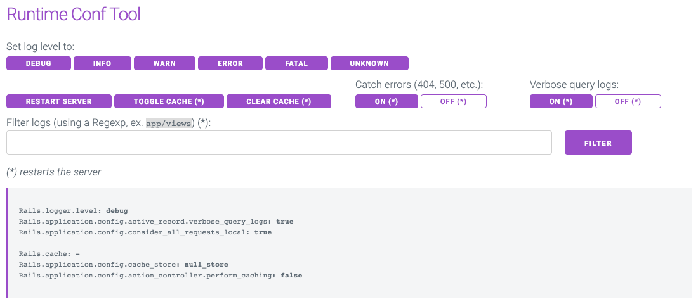

# Runtime Config for Rails 

A middleware to change configuration parameters at runtime for Rails 5.

## Installation and Usage

- Add to `Gemfile`: `gem 'runtime_config'`
- Add to `config/environments/development.rb`: `config.middleware.use RuntimeConfig::Middleware`
- Optionally specify a path, ex. `config.middleware.use RuntimeConfig::Middleware, path: '/some_path'`
- Open the path (or the one set in the option): **/dev**

## Features

- Minimal interface using [milligram.io](https://milligram.io)
- Change log level
- Filter log lines using a RegExp
- Enable/disable catching errors
- Eneble/disable verbose query logs
- Toggle cache
- Clear cache
- Restart server

## Preview

## License

This project is copyright © 2019 [Nebulab](http://nebulab.it/). It is free software, and may be redistributed under the terms specified in the [MIT](LICENSE.txt) license.

## About

DRU is funded and maintained by the [Nebulab](http://nebulab.it/) team.

We firmly believe in the power of open-source. [Contact us](http://nebulab.it/contact-us/) if you like our work and you need help with your project design or development.
